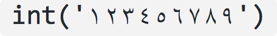

=============
A Python Quiz
=============

:author: Tibs

Produced for the January 2019 meeting of CamPUG_.

Some of the conundrums are taken from the rather wonderful `What the f*ck Python!`_
by `Satwik Kansal`_.

.. _CamPUG: https://www.meetup.com/CamPUG/
.. _`What the f*ck Python!`: https://github.com/satwikkansal/wtfpython
.. _`Satwik Kansal`: http://www.satwikkansal.xyz/

Note that Python 3 is assumed throughout.

----

General: first year
===================

In what year did you first use Python?

----

If that year was prime, score a point

Prime years between 1990 and 2019 are:

      1993,
      1997,
      1999,
      2003,
      2011,
      2017

----

General: beginning with P
=========================

How many programming languages can you name that start with P, not including
Python itself?

----

https://en.wikipedia.org/wiki/List_of_programming_languages lists

P,
P'',
P4,
PARI/GP,
PCASTL,
PCF,
PDL,
PEARL,
PHP,
PIKT,
PILOT,
PL-11,
PL/0,
PL/B,
PL/C,
PL/I,
PL/M,
PL/P,
PL/SQL,
PL360,
PLANC,
PLEX,
PLEXIL,
POP-11,
POP-2,
PPL,
PROIV,
PROMAL,
PROSE modeling language,
PROTEL,
ParaSail,
Pascal,
PeopleCode,
Perl,
Perl 6,
Pharo,
Pico,
Picolisp,
Pict,
Pig (programming tool),
Pike,
Pipelines,
Pizza,
Plankalkül,
Planner,
Plus,
PortablE,
PostScript,
PowerBuilder,
PowerShell,
Powerhouse,
Pro*C,
Processing,
Processing.js,
Prograph,
Prolog,
Promela,
ProvideX,
Pure,
Pure Data,
PureBasic,
and Python itself

----

General: offside rule
=====================

How many programming languages that use significant indentation ("the offside
rule") can you name, excluding Python?

----

https://en.wikipedia.org/wiki/Off-side_rule lists:

ABC,
Boo,
BuddyScript,
Cobra,
CoffeeScript,
Converge,
Curry,
Elixir,
Elm,
F#,
Genie,
Haskell,
Inform 7,
ISWIM,
LiveScript,
Miranda,
Nemerle,
Nim,
occam,
PROMAL,
Scheme,
Spin,
XL,
and Python itself

Apparently ISWIM is the abstract language that introduced the rule.

----

REPL: None
==========

What does this print?

.. code:: python

  >>> None

----

Nothing.

.. code:: python

  >>> None

----

REPL: quit
==========

What does this print?

.. code:: python

  >>> quit

----

.. code:: python

  >>> quit
  Use quit() or Ctrl-D (i.e. EOF) to exit

----

REPL: getting out
=================

So how do you exist the Python prompt? (one point for each obvious mechanism).

----

.. code:: python

  >>> quit()

  >>> exit()

On Windows, the end-of-file character:

.. code:: python

  >>> <CTRL-Z>

On Unix, the endo-of-transmission character:

.. code:: python

  >>> <CTRL-D>

Or even:

.. code:: python

  >>> import sys; sys.exit()

----

Workings: not Perl
==================

What does this print?

.. code:: python

  >>> 1 + '2'

----

.. code:: python

  >>> 1 + '2'
  Traceback (most recent call last):
    File "<stdin>", line 1, in <module>
  TypeError: unsupported operand type(s) for +: 'int' and 'str

.. ' to make vim coloriser happy

----

Workings: to the...
===================

What does the following print?

.. code:: python

    print(2**3, 2^3)

----

.. code:: python

  >>> print(2**3, 2^3)
  8 1

The first is ``power``, and the second ``bitwise exclusive or``.  2 cubed is
8, binary 10 exclusive or'ed with binary 11 is binary 1.

----

Workings: empty function
========================

What does this function return?

.. code:: python

  def fn():
      pass

----

It returns ``None``.

.. code:: python

  >>> def fn():
  ...     pass
  ...
  >>> fn()
  >>> print(fn())
  None

----

Workings: empty function 2
==========================

What does this code do?

.. code:: python

  def fn():
      pass
  fn

----

Well, nothing.

.. code:: python

  >>> def fn():
  ...     pass
  ...
  >>> fn
  <function fn at 0x10fbd7048>

----

Workings: finally return
========================

What does this function return?

.. code:: python

  def fun():
      try:
          return 1
      finally:
          return 2
  
----

.. code:: python

  >>> def fun():
  ...     try:
  ...         return 1
  ...     finally:
  ...         return 2
  ...
  >>> fun()
  2

----

Workings: try/else/finally
==========================

What does this function do?

.. code:: python

   try:
       print('try')
   except Exception:
       print('except')
   else:
       print('else')
   finally:
       print('finally')

----

.. code:: python

  >>> try:
  ...     print('try')
  ... except Exception:
  ...     print('except')
  ... else:
  ...     print('else')
  ... finally:
  ...     print('finally')
  ...
  try
  else
  finally

----

Workings: try/else/finally 2
============================

So what does this function do?

.. code:: python

   try:
       print(f'try {1/0}')
   except Exception:
       print('except')
   else:
       print('else')
   finally:
       print('finally')

----

.. code:: python

  >>> def fn():
  ...     try:
  ...         print(f'try {1/0}')
  ...     except Exception:
  ...         print('except')
  ...     else:
  ...         print('else')
  ...     finally:
  ...         print('finally')
  ...
  >>> fn()
  except
  finally

----

Workings: whose variable now?
=============================

What values should I expect to see printed out when I do the following?

.. code:: python

   class A:
       pass
  
   A.x = 1
   a = A()
   print(A.x, a.x)
   A.x = 2
   print(A.x, a.x)
   a.x = 3
   print(A.x, a.x)

----

.. code:: python

  >>> class A:
  ...     pass
  ...
  >>> A.x = 1
  >>> a = A()
  >>> print(A.x, a.x)
  1 1
  >>> A.x = 2
  >>> print(A.x, a.x)
  2 2
  >>> a.x = 3
  >>> print(A.x, a.x)
  2 3

----

Format strings
==============

Which is generally more useful, the first or second, and why?

.. code:: python

  print(f"The value is '{value}'")

.. code:: python

  print(f"The value is {value!r}")

----

Simple cases are simple:

.. code:: python

  >>> value = 'nine'
  >>> print(f"The value is '{value}' vs {value!r}")
  The value is 'nine' vs 'nine'

Quoting is not obvious:

.. code:: python

  >>> value = "they're ready"
  >>> print(f"The value is '{value}' vs {value!r}")
  The value is 'they're ready' vs "they're ready"

``1`` is not a string:

.. code:: python

  >>> value = 1
  >>> print(f"The value is '{value}' vs {value!r}")
  The value is '1' vs 1

.. Make vim colourisation happy "

----

Format strings 2
================

Which do you think looks simpler?

.. code:: python

    print('The value of %s is %r' % (name, value))
    print('The value of {} is {!r}'.format(name, value))
    print(f'The value of {name} is {value}')

(all produce the same output)

----

.. code:: python

    print('The value of %s is %r' % (name, value))
    print('The value of {} is {!r}'.format(name, value))
    print(f'The value of {name} is {value}')

This is a trick question - it's a personal opinion. In general, for something
this simple, I prefer the third.

-----

Tuples 1
========

How do you create an empty tuple?

----

.. code:: python

  >>> a = ()
  >>> a
  ()
  >>> type(a)
  <class 'tuple'>

----

Tuples 2
========

So how do you create a tuple of one item?

----

.. code:: python

  >>> a = 1,
  >>> a
  (1,)
  >>> type(a)
  <class 'tuple'>

or:

.. code:: python

  >>> a = (1,)
  >>> a
  (1,)
  >>> type(a)
  <class 'tuple'>

----

But the following doesn't work:

.. code:: python

  >>> a = (1)
  >>> a
  1
  >>> type(a)
  <class 'int'>

----

Workings: a natural extension
=============================

What do the values get set to in:

.. code:: python

    tup = (1, 2, 3, 4)
    a, *b, c = tup
    d, *e = tup

----

.. code:: python

  >>> tup = (1, 2, 3, 4)

  >>> a, *b, c = tup
  >>> print(a, b, c)
  1 [2, 3] 4

  >>> d, *e = tup
  >>> print(d, e)
  1 [2, 3, 4]

----

Conundrum: take care with %
===========================

What does the following do?

.. code:: python

  >>> a = 1, 2
  >>> print('a is %s' % a)

----

.. code:: python

  >>> a = 1, 2
  >>> print('a is %s' % a)
  Traceback (most recent call last):
    File "<stdin>", line 1, in <module>
  TypeError: not all arguments converted during string formatting

Which is why you see people doing:

.. code:: python

  >>> print('a is %s' % (a,))
  a is (1, 2)

or using:

.. code:: python

  >>> print(f'a is {a}')
  a is (1, 2)

----

Logging
=======

Given:

.. code:: python

  import logging
  logger = logging.getLogger(__name__)
  a = 3
  b = 4

Which is correct, the first, second or third, and why?

.. code:: python

  logger.info(f'A is {a} and B is {b}')

.. code:: python

  logger.info('A is %s and B is %r' % (a, b))

.. code:: python

  logger.info('A is %s and B is %r', a, b)

----

The third is correct:

.. code:: python

  logger.info('A is %s and B is %r', a, b)

as the logging callable will only construct the final string if the log
message is actually output. In the other two examples, the final string is
created when the ``logger.info`` call is made, even if the callable decides
not to output anything.

----

Workings: more equal than expected
==================================

After doing:

.. code:: python

  a = {}
  a[5] = 'five'
  a[5.0] = 'five point nought'
  a[5.1] = 'five point one'

what does the dictionary contain?

----

.. code:: python

  >>> a = {}
  >>> a[5] = 'five'
  >>> a[5.0] = 'five point nought'
  >>> a[5.1] = 'five point one'
  >>> a
  {5: 'five point nought', 5.1: 'five point one'}

Python regards ``5`` and ``5.0`` as equal (although not the same!)

.. code:: python

  >>> a[5.0]
  'five point nought'
  >>> 5 == 5.0
  True
  >>> 5 is 5.0
  >>> 5 is 5.0
  False

----

Workings: it's a what?
======================

OK, what does the dictionary contain after this?

.. code:: python

  b = {}
  b[0] = 'nought'
  b[1] = 'one'
  b[2] = 'two'
  b[False] = 'false'
  b[True] = 'true'

----

.. code:: python

  >>> b = {}
  >>> b[0] = 'nought'
  >>> b[1] = 'one'
  >>> b[2] = 'two'
  >>> b[False] = 'false'
  >>> b[True] = 'true'
  >>> b
  {0: 'false', 1: 'true', 2: 'two'}

For historical reasons, booleans are subtypes of integers.

.. code:: python

  >>> type(True)
  <class 'bool'>
  >>> isinstance(True, int)
  True
  >>> 1 == True
  True
  >>> True + True
  2

----

Conundrum: enumeration
======================

After doing:

.. code:: python

  some_string = "wtf"
  some_dict = {}
  for i, some_dict[i] in enumerate(some_string):
      pass

what does ``some_dict`` contain?

----

.. code:: python

  >>> some_string = "wtf"
  >>> some_dict = {}
  >>> for i, some_dict[i] in enumerate(some_string):
  ...     pass
  ...
  >>> print(some_dict)
  {0: 'w', 1: 't', 2: 'f'}

It's as if we did:

.. code:: python

  i, some_dict[i] = 0, 'w'
  i, some_dict[i] = 1, 't'
  i, some_dict[i] = 2, 'f'

----

Conundrum: in or not in
=======================

What results do the following produce? (one point for each one corect)

.. code:: python

   1 in [1,2,3]
   [1,2] in [1,2,3]
   'a' in 'abc'
   'ab' in 'abc'
   '' in 'abc'  # that's an empty string

----

.. code:: python

  >>> 1 in [1,2,3]
  True
  >>> [1,2] in [1,2,3]
  False
  >>> 'a' in 'abc'
  True
  >>> 'ab' in 'abc'
  True
  >>> '' in 'abc'
  True

----

Conundrum: C does the same
==========================

What does this print, and why?

.. code:: python

    print("Aha!""")

----

.. code:: python

  >>> print("Aha!""")
  Aha!

is the same as:

.. code:: python

  >>> print("Aha!" "")
  Aha!

which is the same as:

.. code:: python

  >>> print("Aha!" + "")
  Aha!

----

Conundrum: where did it go
==========================

What happens when the following tries to print ``e``?

.. code:: python

  e = 7
  try:
      raise Exception()
  except Exception as e:
      pass
  print(e)

----

.. code:: python

  >>> e = 7
  >>> try:
  ...   raise Exception()
  ... except Exception as e:
  ...   pass
  ...
  >>> print(e)
  NameError: name 'e' is not defined

----

When an ``except`` clause assigns an exception to a target (as here), that
value is cleared at the end of the exception code. So it as if:

.. code:: python

    except Exception as e:
        cope_with_it

is translated into

.. code:: python

    except Exception as e:
        try:
            cope_with_it
        finally:
            del e

----

Conundrum: follow through all the way
=====================================

After the following, what is ``a`` set to, and why?

.. code:: python

  a, b = a[b] = {}, 5

----

.. code:: python

  >>> a, b = a[b] = {}, 5
  >>> print(a)
  {5: ({...}, 5)}

----

Python defines assignment statements as::

    (target_list "=")+ (expression_list | yield_expression)

and says:

        An assignment statement evaluates the expression list (remember that
        this can be a single expression or a comma-separated list, the latter
        yielding a tuple) and assigns the single resulting object to each of
        the target lists, from left to right.

----

So our example is the same as doing:

.. code:: python

  >>> exp = {}, 5
  >>> print(exp)
  {} 5

  >>> a, b = exp
  >>> print(a, b)
  {} 5

Now, ``a`` refers to the same dictionary as in ``exp[0]``.

.. code:: python

  >>> a[5] = exp
  >>> print(a)
  {5: ({...}, 5)}

and we've got a recursive datastructure - the ``...`` above indicates this.

.. code:: python

  >>> a is exp[0] is a[5][0] is a[5][0][5][0]  # and so on
  True

----

Conundrum: mutation 1
=====================

What values do you expect to remain in ``list1`` after doing:

.. code:: python

  list1 = [1, 2, 3, 4]
  for item in list1:
    list1.remove(item)

----

.. code:: python

  >>> list1 = [1, 2, 3, 4]
  >>> for item in list1:
  ...   list1.remove(item)
  ...
  >>> print(list1)
  [2, 4]

We look at the list ``[1, 2, 3, 4]``, take its first value as ``item``,
and remove that, leaving us with ``[2, 3, 4]``.

Then we look at the list ``[2, 3, 4]`` and take its *second* value as
``item``, and remove that, leaving us with ``[2, 4]``.

There isn't a third value in ``[2, 4]``, so we're done.

----

Conundrum: mutation 2
=====================

What values do you expect to remain in ``list2`` after doing:

.. code:: python

  list2 = [1, 2, 3, 4]
  for index, item in enumerate(list2):
    list2.pop(index)

----

.. code:: python

  >>> list2 = [1, 2, 3, 4]
  >>> for index, item in enumerate(list2):
  ...   list2.pop(index)
  ...
  1
  3
  >>> print(list2)
  [2, 4]

We evaluate ``enumerate(list2)`` before the first loop, and that gives us an
iterator independent of the content of the list, which will return the values
``(0, 1)``, ``(1, 2)``, ``(2, 3)``, ``(3, 4)``.

So our first time round the loop we pop ``list2[0]`` from ``[1, 2, 3, 4]``.

The second time round we pop ``list[1]`` from ``[2, 3, 4]``, leaving us with
``[2, 4]``.

And the next time round, there isn't a ``list[2]`` in ``[2, 4]`` so we're
done.

-----

Conundrum: don't do this at home
================================

What does the following code print out?

.. code:: python

  def some_func(default_arg=[]):
      default_arg.append("ick")
      print(default_arg)

  some_func()
  some_func()
  some_func(['aha'])
  some_func()

----

.. code:: python

  >>> def some_func(arg=[]):
  ...     arg.append("ick")
  ...     print(arg)
  ...
  >>> some_func()
  ['ick']
  >>> some_func()
  ['ick', 'ick']
  >>> some_func(['aha'])
  ['aha', 'ick']
  >>> some_func()
  ['ick', 'ick', 'ick']

----

Perhaps we meant to do something more like:

.. code:: python

    def some_func(arg=None):
        if not arg:
            arg = []
        arg.append("ick")
        print(arg)

----

Conundrum: two things that are not the same
===========================================

What do we expect ``a`` and ``b`` to end up as?

.. code:: python

    a = [1, 2, 3, 4]
    b = a
    a = a + [5, 6, 7, 8]

----

.. code:: python

  >>> a = [1, 2, 3, 4]
  >>> b = a
  >>> a = a + [5, 6, 7, 8]
  >>> a
  [1, 2, 3, 4, 5, 6, 7, 8]
  >>> b
  [1, 2, 3, 4]

Our final ``a`` is a new list, not the same as the original ``a``.

----

What about now?

.. code:: python

  a = [1, 2, 3, 4]
  b = a
  a += [5, 6, 7, 8]

----

Conundrum: two things that are not the same?
============================================

.. code:: python

  >>> a = [1, 2, 3, 4]
  >>> b = a
  >>> a += [5, 6, 7, 8]
  >>> a
  [1, 2, 3, 4, 5, 6, 7, 8]
  >>> b
  [1, 2, 3, 4, 5, 6, 7, 8]

``+=`` is not guaranteed to be the same as using ``+`` on an object, and in
particular it does ``extend`` on a list. So ``a`` has its contents altered,
and ``b`` refers to the same object as ``a`` does.

----

Conundrum: unicode
==================

What does |unicode-integer| return?

----

|unicode-integer| returns ``123456789``

In Python, Decimal characters include digit characters, and all characters
that can be used to form decimal-radix numbers, e.g. ``U+0660, ARABIC-INDIC
DIGIT ZERO``.

.. int('١٢٣٤٥٦٧٨٩')`` - to get this to render via xelatex (and pandoc) seems
.. to be a pain - the default tt font doesn't have the requisite characters.
.. So let's fall back to a picture(!)

----

Practicality: Why do we need self?
==================================

.. code:: python

  class A:
      def __init__(self, arg):
          self.arg = arg
      def incr(self):
          self.arg += 1

----

#. We need it as a method argument because it doesn't have to be called
   "self" - i.e., the programmer has to say what name to use.

   .. note:: Also, if we want to be able to pass it in (so we can call a
     method as ``<class_name>.<method_name>(<instance>, ...)``) then it helps
     to have an explicit place in the argument list for it. Although this is
     an edge case, and one could argue that it doesn't of itself *require*
     having `self` explicitly mentioned in the arguments.

#. We need it in a method body to differentiate between:

   .. code:: python

      A.arg = 3
      self.arg = 3
      arg = 3

.. vim: set filetype=rst tabstop=8 softtabstop=2 shiftwidth=2 expandtab:
