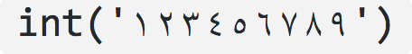

Things to borrow from WTF Python
================================

NB: Maybe mark them in some way in the final document / slides, to indicate
their source.

--------------------------------------------

Time for some hash brownies!
============================

.. code:: python

    some_dict = {}
    some_dict[5.5] = "Ruby"
    some_dict[5.0] = "JavaScript"
    some_dict[5] = "Python"

Output:

  .. code:: python

    >>> some_dict[5.5]
    "Ruby"
    >>> some_dict[5.0]
    "Python"
    >>> some_dict[5]
    "Python"

"Python" destroyed the existence of "JavaScript"?

Explanation:

* Python dictionaries check for equality and compare the hash value to
  determine if two keys are the same.  Immutable objects with same value
  always have the same hash in Python.

  .. code:: python

    >>> 5 == 5.0
    True
    >>> hash(5) == hash(5.0)
    True

  *Note:* Objects with different values may also have same hash (known as hash
  collision).

When the statement ``some_dict[5] = "Python"`` is executed, the existing value
``"JavaScript"`` is overwritten with ``"Python"`` because Python recognizes
``5`` and ``5.0`` as the same keys of the dictionary some_dict.

This StackOverflow answer__ explains beautifully the rationale behind it.

__ https://stackoverflow.com/a/32211042/4354153

--------------------------------------------

Return return everywhere!
=========================

 .. code:: python

  def some_func():
      try:
          return 'from_try'
      finally:
          return 'from_finally'

Output:

.. code:: python

  >>> some_func()
  'from_finally'

Explanation:

When a return, break or continue statement is executed in the try suite of a
"try…finally" statement, the finally clause is also executed ‘on the way
out.

The return value of a function is determined by the last return statement
executed. Since the finally clause always executes, a return statement
executed in the finally clause will always be the last one executed.

--------------------------------------------

For what?
=========

.. code:: python

  some_string = "wtf"
  some_dict = {}
  for i, some_dict[i] in enumerate(some_string):
      pass

Output:

.. code:: python

  >>> some_dict # An indexed dict is created.
  {0: 'w', 1: 't', 2: 'f'}

Explanation:

A for statement is defined in the Python grammar as::

    for_stmt: 'for' exprlist 'in' testlist ':' suite ['else' ':' suite]

Where ``exprlist`` is the assignment target. This means that the equivalent of
``{exprlist} = {next_value}`` is executed for each item in the iterable. An
interesting example that illustrates this:

.. code:: python

    for i in range(4):
        print(i)
        i = 10

Output:

.. code:: python

    0
    1
    2
    3

Did you expect the loop to run just once?

Explanation:

The assignment statement ``i = 10`` never affects the iterations of the loop
because of the way for loops work in Python. Before the beginning of every
iteration, the next item provided by the iterator (``range(4)`` this case) is
unpacked and assigned the target list variables (``i`` in this case).

The ``enumerate(some_string)`` function yields a new value ``i`` (a counter
going up) and a character from the some_string in each iteration. It then sets
the (just assigned) ``i`` key of the dictionary ``some_dict`` to that
character. The unrolling of the loop can be simplified as:

.. code:: python

    >>> i, some_dict[i] = (0, 'w')
    >>> i, some_dict[i] = (1, 't')
    >>> i, some_dict[i] = (2, 'f')
    >>> some_dict

--------------------------------------------

*If this is used, it needs to follow some talk about names in Python being
like post-it labels on objects, and that everything in Python is an object,
and that things like lists are mutable objects - i.e., their content, their
inside, can be changed.*

Evaluation time discrepancy
===========================

1.

  .. code:: python

    array = [1, 8, 15]
    g = (x for x in array if array.count(x) > 0)
    array = [2, 8, 22]

  Output:

  .. code:: python

    >>> print(list(g))
    [8]

2.

  .. code:: python

    array_1 = [1,2,3,4]
    g1 = (x for x in array_1)
    array_1 = [1,2,3,4,5]

    array_2 = [1,2,3,4]
    g2 = (x for x in array_2)
    array_2[:] = [1,2,3,4,5]

  Output:

  .. code:: python

    >>> print(list(g1))
    [1,2,3,4]

    >>> print(list(g2))
    [1,2,3,4,5]

Explanation

In a generator expression, the in clause is evaluated at declaration time, but
the conditional clause is evaluated at runtime.

So before runtime, ``array`` is re-assigned to the list ``[2, 8, 22]``, and
since out of 1, 8 and 15, only the count of 8 is greater than 0, the generator
only yields 8.

The differences in the output of ``g1`` and ``g2`` in the second part is due
to the way variables ``array_1`` and ``array_2`` are re-assigned values.

In the first case, ``array_1`` is bound to the new object ``[1,2,3,4,5]`` and
since the in clause is evaluated at the declaration time it still refers to
the old object ``[1,2,3,4]`` (which is not destroyed).

In the second case, the slice assignment to ``array_2`` updates the same old
object ``[1,2,3,4]`` to ``[1,2,3,4,5]``. Hence both the ``g2`` and ``array_2``
still have reference to the same object (which has now been updated to
``[1,2,3,4,5]``).

--------------------------------------------

is not ... is not is (not ...)
==============================

.. code:: python

  >>> 'something' is not None
  True
  >>> 'something' is (not None)
  False

Explanation

``is not`` is a single binary operator, and has behavior different than using
``is`` and ``not`` separated.

``is`` not evaluates to False if the variables on either side of the operator
point to the same object and True otherwise.

--------------------------------------------

**OR** perhaps talk about ``in`` and ``not in``, which have some of the same
behaviour. Also, ``in`` is worth talking about, because of:

.. code:: python

  1 in [1, 2, 3]

and:

.. code:: python

  'a' in 'abcdef'

and:

.. code:: python

  'abc' in 'abcdef'

(that last *should* be surprising!)

--------------------------------------------

Backslashes at the end of string
================================

Output:

.. code:: python

  >>> print("\\ C:\\")
  \ C:\
  >>> print(r"\ C:")
  \ C:
  >>> print(r"\ C:\")

      File "<stdin>", line 1
        print(r"\ C:\")
                       ^
  SyntaxError: EOL while scanning string literal

Explanation

In a raw string literal, as indicated by the prefix ``r``, the backslash
doesn't have the special meaning.

.. code:: python

    >>> print(repr(r"wt\"f"))
    'wt\\"f'

What the interpreter actually does, though, is simply change the behavior of
backslashes, so they pass themselves and the following character through.
That's why backslashes don't work at the end of a raw string.

    *(I didn't know that!)*

--------------------------------------------

Half triple-quoted strings
==========================

Output:

.. code:: python

  >>> print('wtfpython''')
  wtfpython
  >>> print("wtfpython""")
  wtfpython
  >>> # The following statements raise `SyntaxError`
  >>> # print('''wtfpython')
  >>> # print("""wtfpython")

Explanation:

Python supports implicit string literal concatenation, Example,

.. code:: python

    >>> print("wtf" "python")
    wtfpython
    >>> print("wtf" "") # or "wtf"""
    wtf

``'''`` and ``"""`` are also string delimiters in Python which causes a
SyntaxError because the Python interpreter was expecting a terminating triple
quote as delimiter while scanning the currently encountered triple quoted
string literal.

--------------------------------------------

*NB: I think that I may not use this directly, but definitely should do
something about boolean being "really" a form of integer.*

What's wrong with booleans?
===========================

1.

  .. code:: python

    # A simple example to count the number of boolean and
    # integers in an iterable of mixed data types.
    mixed_list = [False, 1.0, "some_string", 3, True, [], False]
    integers_found_so_far = 0
    booleans_found_so_far = 0

    for item in mixed_list:
        if isinstance(item, int):
            integers_found_so_far += 1
        elif isinstance(item, bool):
            booleans_found_so_far += 1

  Output:

  .. code:: python

    >>> integers_found_so_far
    4
    >>> booleans_found_so_far
    0

2.

  .. code:: python

    another_dict = {}
    another_dict[True] = "JavaScript"
    another_dict[1] = "Ruby"
    another_dict[1.0] = "Python"

  Output:

  .. code:: python

    >>> another_dict[True]
    "Python"

3.

  .. code:: python

    >>> some_bool = True
    >>> "wtf"*some_bool
    'wtf'
    >>> some_bool = False
    >>> "wtf"*some_bool
    ''

Explanation:

Booleans are a subclass of ``int``

.. code:: python

    >>> isinstance(True, int)
    True
    >>> isinstance(False, int)
    True

The integer value of True is 1 and that of False is 0.

.. code:: python

    >>> True == 1 == 1.0 and False == 0 == 0.0
    True

See this StackOverflow answer__ for the rationale behind it.

__ https://stackoverflow.com/a/8169049/4354153

--------------------------------------------

*Again, maybe simplify / abstract*

The disappearing variable from outer scope
==========================================

.. code:: python

  e = 7
  try:
      raise Exception()
  except Exception as e:
      pass

Output (Python 3.x):

.. code:: python

  >>> print(e)
  NameError: name 'e' is not defined

Explanation:

Source: https://docs.python.org/3/reference/compound_stmts.html#except

When an exception has been assigned using as target, it is cleared at the end
of the except clause. This is as if

.. code:: python

    except E as N:
        foo

was translated into

.. code:: python

    except E as N:
        try:
            foo
        finally:
            del N

This means the exception must be assigned to a different name to be able to
refer to it after the except clause. Exceptions are cleared because, with the
traceback attached to them, they form a reference cycle with the stack frame,
keeping all locals in that frame alive until the next garbage collection
occurs.

The clauses are not scoped in Python. Everything in the example is present in
the same scope, and the variable e got removed due to the execution of the
except clause. The same is not the case with functions which have their
separate inner-scopes. The example below illustrates this:

.. code:: python

    def f(x):
        del(x)
        print(x)

    x = 5
    y = [5, 4, 3]

Output:

.. code:: python

    >>>f(x)
    UnboundLocalError: local variable 'x' referenced before assignment
    >>>f(y)
    UnboundLocalError: local variable 'x' referenced before assignment
    >>> x
    5
    >>> y
    [5, 4, 3]

--------------------------------------------

*Definitely want to do this, but may need to explain it differently, as I
don't want to assume that people necessarily understand circular references.*

Let's see if you can guess this?
================================

.. code:: python

  a, b = a[b] = {}, 5

Output:

.. code:: python

  >>> a
  {5: ({...}, 5)}

Explanation:

According to Python language reference, assignment statements have the form::

    (target_list "=")+ (expression_list | yield_expression)

and:

        An assignment statement evaluates the expression list (remember that
        this can be a single expression or a comma-separated list, the latter
        yielding a tuple) and assigns the single resulting object to each of
        the target lists, from left to right.

The ``+`` in ``(target_list "=")+`` means there can be one or more target
lists. In this case, target lists are ``a``, ``b`` and ``a[b]`` (note the
expression list is exactly one, which in our case is ``{}, 5``).

After the expression list is evaluated, its value is unpacked to the target
lists from left to right. So, in our case, first the ``{}, 5`` tuple is unpacked
to ``a, b`` and we now have ``a = {}`` and ``b = 5``.

``a`` is now assigned to ``{}`` which is a mutable object.

The second target list is ``a[b]`` (you may expect this to throw an error
because both ``a`` and ``b`` have not been defined in the statements before.
But remember, we just assigned ``a`` to ``{}`` and ``b`` to ``5``).

Now, we are setting the key ``5`` in the dictionary to the tuple ``({}, 5)``
creating a circular reference (the ``{...}`` in the output refers to the same
object that ``a`` is already referencing). Another simpler example of circular
reference could be

.. code:: python

    >>> some_list = some_list[0] = [0]
    >>> some_list
    [[...]]
    >>> some_list[0]
    [[...]]
    >>> some_list is some_list[0]
    True
    >>> some_list[0][0][0][0][0][0] == some_list
    True

Similar is the case in our example (``a[b][0]`` is the same object as ``a``)

So to sum it up, you can break the example down to

.. code:: python

    a, b = {}, 5
    a[b] = a, b

And the circular reference can be justified by the fact that ``a[b][0]`` is
the same object as ``a``

.. code:: python

    >>> a[b][0] is a
    True

--------------------------------------------

*Maybe drop the pop/remove calls, and just use them in the explanation.*

Deleting a list item while iterating
====================================

.. code:: python

  list_1 = [1, 2, 3, 4]
  list_2 = [1, 2, 3, 4]
  list_3 = [1, 2, 3, 4]
  list_4 = [1, 2, 3, 4]

  for idx, item in enumerate(list_1):
      del item

  for idx, item in enumerate(list_2):
      list_2.remove(item)

  for idx, item in enumerate(list_3[:]):
      list_3.remove(item)

  for idx, item in enumerate(list_4):
      list_4.pop(idx)

Output:

.. code:: python

  >>> list_1
  [1, 2, 3, 4]
  >>> list_2
  [2, 4]
  >>> list_3
  []
  >>> list_4
  [2, 4]

Can you guess why the output is ``[2, 4]``?

Explanation:

It's never a good idea to change the object you're iterating over. The correct
way to do so is to iterate over a copy of the object instead, and
``list_3[:]`` does just that.

.. code:: python

    >>> some_list = [1, 2, 3, 4]
    >>> id(some_list)
    139798789457608
    >>> id(some_list[:]) # Notice that python creates new object for sliced list.
    139798779601192

Difference between del, remove, and pop:

* ``del var_name`` just removes the binding of the ``var_name`` from the local
  or global namespace (That's why the ``list_1`` is unaffected).
* ``remove`` removes the first matching value, not a specific index, and
  raises ``ValueError`` if the value is not found.
* ``pop`` removes the element at a specific index and returns it, and raises
  ``IndexError`` if an invalid index is specified.

Why the output is [2, 4]?

The list iteration is done index by index, and when we remove ``1`` from
``list_2`` or ``list_4``, the contents of the lists are now ``[2, 3, 4]``. The
remaining elements are shifted down, i.e., ``2`` is at index 0, and ``3`` is
at index 1. Since the next iteration is going to look at index 1 (which is the
``3``), the ``2`` gets skipped entirely. A similar thing will happen with
every alternate element in the list sequence.

Refer to this StackOverflow thread__ explaining the example

See also this nice StackOverflow thread__ for a similar example related to dictionaries in Python.

__ https://stackoverflow.com/questions/45946228/what-happens-when-you-try-to-delete-a-list-element-while-iterating-over-it
__ https://stackoverflow.com/questions/45877614/how-to-change-all-the-dictionary-keys-in-a-for-loop-with-d-items

--------------------------------------------

Beware of default mutable arguments!
====================================

.. code:: python

  def some_func(default_arg=[]):
      default_arg.append("some_string")
      return default_arg

Output:

.. code:: python

  >>> some_func()
  ['some_string']
  >>> some_func()
  ['some_string', 'some_string']
  >>> some_func([])
  ['some_string']
  >>> some_func()
  ['some_string', 'some_string', 'some_string']

Explanation:

The default mutable arguments of functions in Python aren't really initialized
every time you call the function. Instead, the recently assigned value to them
is used as the default value. When we explicitly passed ``[]`` to
``some_func`` as the argument, the default value of the ``default_arg``
variable was not used, so the function returned as expected.

.. code:: python

    def some_func(default_arg=[]):
        default_arg.append("some_string")
        return default_arg

Output:

.. code:: python

    >>> some_func.__defaults__  # This will show the default argument values for the function
    ([],)
    >>> some_func()
    >>> some_func.__defaults__
    (['some_string'],)
    >>> some_func()
    >>> some_func.__defaults__
    (['some_string', 'some_string'],)
    >>> some_func([])
    >>> some_func.__defaults__
    (['some_string', 'some_string'],)

A common practice to avoid bugs due to mutable arguments is to assign ``None``
as the default value and later check if any value is passed to the function
corresponding to that argument. Example:

.. code:: python

    def some_func(default_arg=None):
        if not default_arg:
            default_arg = []
        default_arg.append("some_string")
        return default_arg

--------------------------------------------

*This one is valuable for people comming from C / C++ / etc., or anyone else
who assumes that they can "guess" how += works.*

Same operands, different story!
===============================

1.

  .. code:: python

    a = [1, 2, 3, 4]
    b = a
    a = a + [5, 6, 7, 8]

  Output:

  .. code:: python

    >>> a
    [1, 2, 3, 4, 5, 6, 7, 8]
    >>> b
    [1, 2, 3, 4]

2.

  .. code:: python

    a = [1, 2, 3, 4]
    b = a
    a += [5, 6, 7, 8]

  Output:

  .. code:: python

    >>> a
    [1, 2, 3, 4, 5, 6, 7, 8]
    >>> b
    [1, 2, 3, 4, 5, 6, 7, 8]

Explanation:

``a += b`` doesn't always behave the same way as ``a = a + b``. Classes may
implement the ``op=`` operators differently, and lists do this.

The expression ``a = a + [5,6,7,8]`` generates a new list and sets ``a``'s
reference to that new list, leaving ``b`` unchanged.

The expression ``a += [5,6,7,8]`` is actually mapped to an "extend" function
that operates on the list such that ``a`` and ``b`` still point to the same
list that has been modified in-place.

--------------------------------------------

Yes, it exists!
===============

The else clause for loops. One typical example might be:

.. code:: python

  def does_exists_num(l, to_find):
      for num in l:
          if num == to_find:
              print("Exists!")
              break
      else:
          print("Does not exist")

Output:

.. code:: python

  >>> some_list = [1, 2, 3, 4, 5]
  >>> does_exists_num(some_list, 4)
  Exists!
  >>> does_exists_num(some_list, -1)
  Does not exist

The else clause in exception handling. An example,

.. code:: python

  try:
      pass
  except:
      print("Exception occurred!!!")
  else:
      print("Try block executed successfully...")

Output:

  Try block executed successfully...

Explanation:

The else clause after a loop is executed only when there's no explicit break
after all the iterations.

The else clause after a try block is also called "completion clause" as
reaching the else clause in a try statement means that the try block actually
completed successfully.

*My example also using finally is more complex...*

--------------------------------------------

Minor Ones
==========

``join()`` is a string operation instead of list operation. People often seem
to get upset by this.

Explanation: If ``join()`` is a method on a string then it can operate on any
iterable (list, tuple, iterators). If it were a method on a list, it'd have to
be implemented separately by every type. Also, it doesn't make much sense to
put a string-specific method on a generic list object API.

A few weird looking but semantically correct statements:

* ``[] = ()`` is a semantically correct statement (unpacking an empty tuple into an empty list)
* ``'a'[0][0][0][0][0]`` is also a semantically correct statement as strings
  are sequences (iterables supporting element access using integer indices) in
  Python.
* ``3 --0-- 5 == 8`` and ``--5 == 5`` are both semantically correct statements
  and evaluate to True.

Given that ``a`` is a number, ``++a`` and ``--a`` are both valid Python
statements but don't behave the same way as compared with similar statements
in languages like C, C++ or Java.

.. code:: python

    >>> a = 5
    >>> a
    5
    >>> ++a
    5
    >>> --a
    5

Explanation:

There is no ``++`` operator in Python grammar. It is actually two `+` operators.

``++a`` parses as ``+(+a)`` which translates to ``a``. Similarly, the output
of the statement ``--a`` can be justified.

This StackOverflow thread__ discusses the rationale behind the absence of
increment and decrement operators in Python.

__ https://stackoverflow.com/questions/3654830/why-are-there-no-and-operators-in-python

--------------------------------------------

List slicing with out of the bounds indices throws no errors

.. code:: python

  >>> some_list = [1, 2, 3, 4, 5]
  >>> some_list[111:]
  []

--------------------------------------------

|unicode-integer| returns ``123456789`` in Python 3. In Python, Decimal
characters include digit characters, and all characters that can be used to
form decimal-radix numbers, e.g. ``U+0660, ARABIC-INDIC DIGIT ZERO``. Here's
an `interesting story`__ related to this behavior of Python.

.. int('١٢٣٤٥٦٧٨٩')`` - to get this to render via xelatex (and pandoc) seems
.. to be a pain - the default tt font doesn't have the requisite characters.
.. So let's fall back to a picture(!)

__ http://chris.improbable.org/2014/8/25/adventures-in-unicode-digits/

.. vim: set filetype=rst tabstop=8 softtabstop=2 shiftwidth=2 expandtab:
